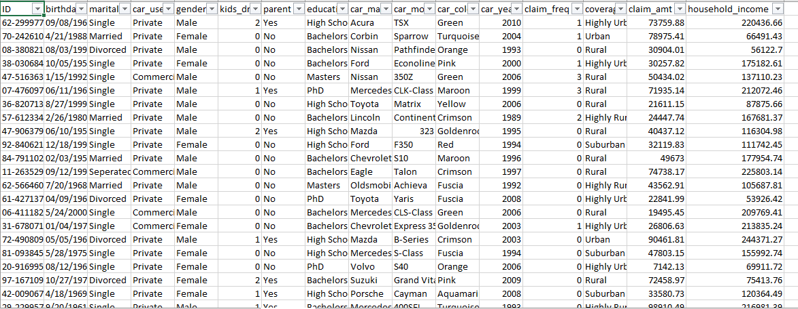

# Car Insurance Policy Analysis

## Introduction
According to Investopedia, Car insurance is effectively a contract between an individual and an insurance company in which the individual agrees to pay premiums in exchange for protection against financial losses stemming from an accident or other damage to the vehicle. Auto insurance can offer coverage for:
- Vehicle damages, including your car or another driver's vehicle
- Property damage or bodily injuries caused by an accident
- Medical bills and/or funeral expenses associated with injuries sustained in an accident
Using dataset obtained from Onyx Data, I analyzed how car insurance claims is affected by customer demographics. I also investigated how the total claims frequency and average calimamounts vary by car model and marital status.

**_Disclaimer_**: _All datasets and reports do not represent my company, institution, or country. The dataset used for the creation of this report can be found for free on [Onyx Data](https://onyxdata.ck.page/8cbde7b71b)

## Business Objectives
1.  What is the total number of customers in the dataset?
2.  What is the average insurance claim amount?
3.  What is the total claim frequency?
4.  How do the customer demographics like education, gender, marital status and parental status influence claims?
5.  What is the total claim frequency by marital status and car model?
6.  Which car models are responsible for higher insurance claim amounts on average?

## Skills demonstrated:
The following Microsoft Excel skills were incorporated
* Macros 
* Dashboard design 
* Pivot Tables and Pivot Charts
* Filters and Filter design
* Data transformation in Excel Power Query
* XLOOKUP Function

## Data Transformation
The raw data were imported into Excel Power Query. The following transformation steps were applied:
- The raw data was first converted into a Table
- THe birthdate column was in the wrong format - mm/dd/yyyy instead of dd/mm/yyyy. This was corrected
- A new column named "Age" which will contain the age of each customer
- Upon closer inspection, it was observed that in "car_model" column, some of the car models were written in date format. These cars were made by the car manufacturer "Saab Automobile". Since there was no way to confirm the exact make, all of such erroneous date values were replaced with "N/A"
- The query was then renamed as "Insurance" and loaded into Excel.

Raw Data              |         
:--------------------:|

Cleaned Data
:-----------------------:

## Data Analysis and Visualization
The analysis steps were carried out in Excel using Pivot Tables and Pivot charts. The dashboard that was designed can be found and interacted with [here](CarInsurancePolicyData.xlsx). This workbook consists of the following sheets:
1.  The Home Page with some interactive buttons for navigation
2.  The Interactive Dashboard
3.  The Raw Data (named Raw Data)
4.  The Transformed Data (named Insurance Policies - Data)
5.  Other sheets containing the Pivot tables and pivot charts

### Home Page:

This page contains a welcome picture as well as three buttons for navigation to:
-  Dashboard
-  Raw Data
-  Transformed Data

### Dashboard:

This page contains the following:
- title
- the filters
- the various interactive pivot charts
- the navigation buttons close to the dashboard title

### Other workbook components:
These include:
- The raw data as downloaded from onyx data.
- The Transformed data after the raw data was transformed in Excel Power Query
- Other sheets corresponding to the pivot tables and charts

## Insights
1.  The total customers surveyed was 37542
2.  The average claims amount was $50,028.51
3.  The total claim frequency is 19158
4.  Equal proportion of males and females make car insurance claims
5.  More non-parents make car insurance claims compared to parents
6.  Single individuals make more insurance claims. Also, individuals with a bachelor's degree incur more car insurance claims.
7.  The following cars models are associated with the most insurance claims on average:
   * Crossfire roadster
   * Truck Xtracrab
   * Dastsun/Nissan Z-car
   * Minx Magnificient
   * Virage

## Recommendations
Insurance companies should ensure that single non-parents should be educated on driving safety and precautionary measures as part of the services they offer their customers (at no charge). This will reduce the expenses they incur on paying claims out to such customer demographic.
Also, manufacturers of car models associated with the most insurance claims and claim amounts should be investigated on the reasons for such higher frequencies and claim amounts. If it is discovered to be a manufacturer problem, the manufacturers should be made to pay heavier taxes for manufacturing more units of those cars.

## Limitations of Analysis
This analysis doesn't cover popular car insurance metrics such as average time to settle a claim, average revenue per policy holder, components of claim costs, customer retention rates e.t.c due to the limited data collected and the absence of fields to measure such metrics
Also, the exact location the data was collected wasn't delineated in the data source. This means that the results of the analysis may not be translated to say data collectes from United Kingdom, Nigeria, Russia or any other country.

